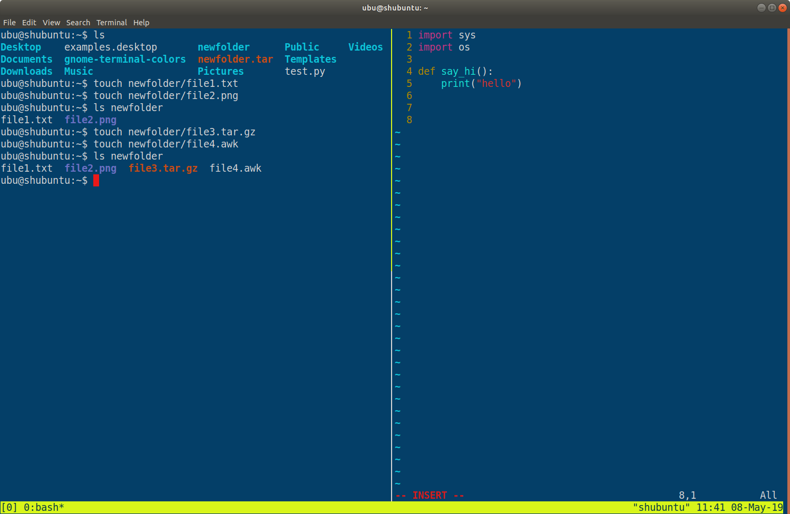

<h1> Gnome Terminal Profiles</h1>

<h2> How to use </h2>
<h6> 1. Download the .dconf file</h6>

<h6>2. rename it to  </h6>
*gnome-terminal-profiles.dconf*

<h6>3. run this command: </h6>
~~~~
  dconf load /org/gnome/terminal/legacy/profiles:/ < gnome-terminal-profiles.dconf
~~~~

<h6>4. open a new terminal and enjoy!</h6>

<h3> vivid-blue</h3>

